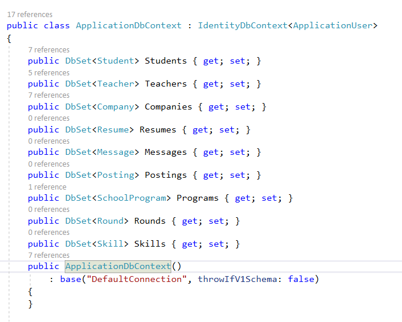

### 1. We did all our planning on a trello board like this


# 2. <b><span style="color:orange">Code first design </b>

-All classes and relationships were the first thing we set up
-Everyone is an application user, extending the applicationuser class

it goes like this

```
public class Student : ApplicationUser
```

<i>Extending ApplicationUser means that everybody who extends ApplicationUser is stored in the same table.
this also means that they can access functions for ApplicationUser.
this saves some work in the long run, I think.</i>
<br>

---

#### Classes look like this

## 

#### Db Context looks like this




<span style="color:cyan">Extending applicationuser puts everyone into the same table, with an automatically generated column called Discriminator.</span>


All of the unused fields that exist in some child classes, but not in others, will remain null.

---

this is the function that I didn't want to rewrite or extend


### 3. <b><span style="color:cyan">Seed method and making sure that all login functionality was working</b>

    ->There were some functionality issues with SignInManager and UserManager
    that took a while to resolve, but they're working properly now.
    Everyone that creates an account, Students, Companies and Teachers,
    can create an account and login


<br>
<br>

---

<br>
#### 4. <b><span style="color:rgb(255, 99, 71)">All controllers are built, allowing for minimum behaviours. Account creation, sign in, seeing details of users, etc. </b>
<br>
<br>

---

<br>

### 5. <b><span style="color:cyan">Some of the important helper functions are finished:</b>

    -> File upload function


<br>
<br>

---

<br>
### 6. <b><span style="color:cyan">Currently planning and beginning to execute on some of the important views.</b>

    -> Making sure what exactly we want to display in each of the views
    ->

    -> Some differential displays depending on if you are viewing your own account (maybe)
